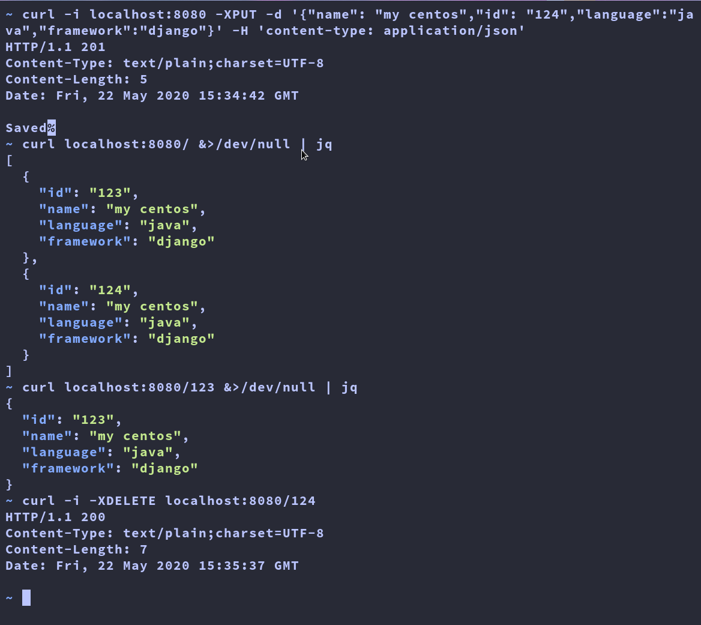

## Kaiburr REST API

A task project for the Kaiburr recruitment process.

---

### Features

* GET endpoints in spring boot
* PUT endpoint in spring boot
* DELETE endpoint in spring boot
* Dockerized image
* Docker compose orchestration

---

### Pre-requisites

* OpenJDK 8
* Maven
* MongoDB
* Docker (note that if you have docker then you do not need any of the above pre-requisites)

---

### How to run

The following command will run a local mongoDB instance in a docker container binded to port `27017` and a maven application bound to port `8080`.

```sh
docker-compose up -d
```

---

### How to query

| Description | Method | Payload | Response |
|:--:|:--:|:--:|:--:|
| Insert data | PUT | name,id,language,framework as JSON | Status: 201 |
| Read all data | GET | | status 200, data name,id,language,framework as JSON |
| Read by ID | GET | url parameter `localhost:8080/{id}` | status 200 name,id,language,framework as JSON|
| Delete by ID | DELETE | url parameter `localhost:8080/{id}` | 200 |



--- 

### Server URL

* Base URL for the API: `139.59.78.167`
* VM Monitoring: `http://139.59.78.167:19999/#menu_system_submenu_ram;theme=slate`

---

Made with :heart: by Vishvam Vyas
